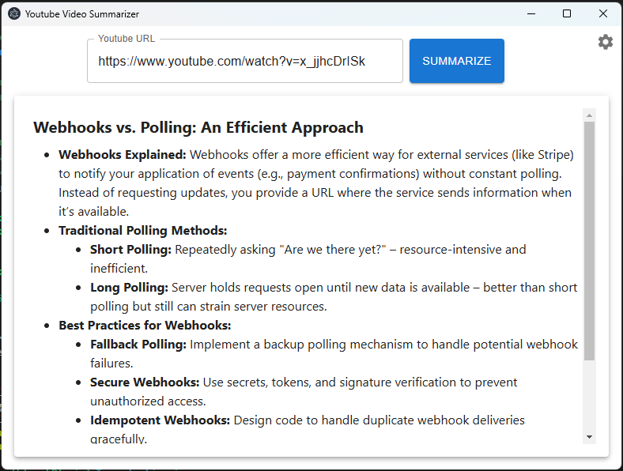

# Youtube Summarizer

## Why?

- Know whether a 15 minute video is worth watching without spending 15 minutes.
- Prevent getting clickbaited by knowing the actual content before clicking.
- Get summaries for videos.

Works with both OpenAI and LM Studio API's. Option to automatically copy-paste Youtube URL from clipboard.

## Which model can be used when self-hosting?

| Model                         | Notes                                                         |
| ----------------------------- | ------------------------------------------------------------- |
| Gemma 3 1B Q3_K_L             | Not recommended, hallucinates                                 |
| Gemma 2 2B Q4_K_M             | OKish summaries, fast operation                               |
| **Gemma 3 4B Q4_K_M**         | Recommended, more coherent language than with Gemma 2 2B      |
| Larger models                 | Marginal additional benefits, slower                          |
